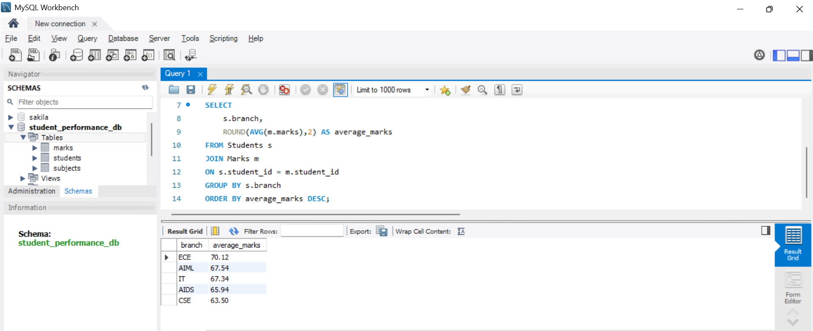
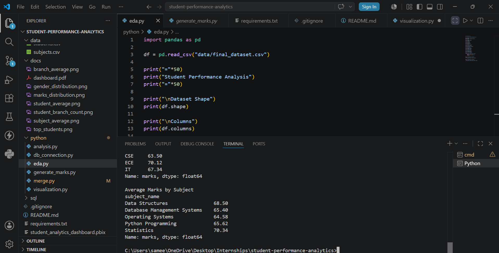
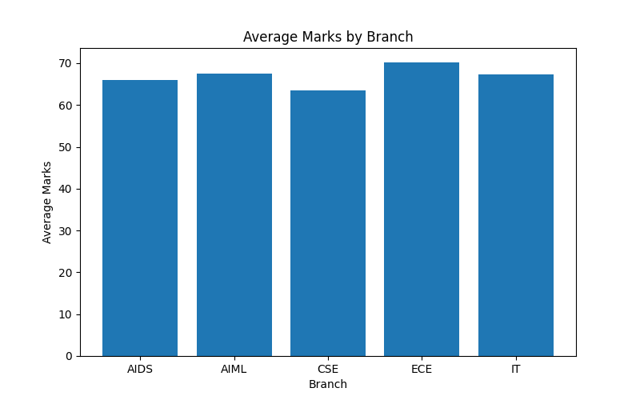
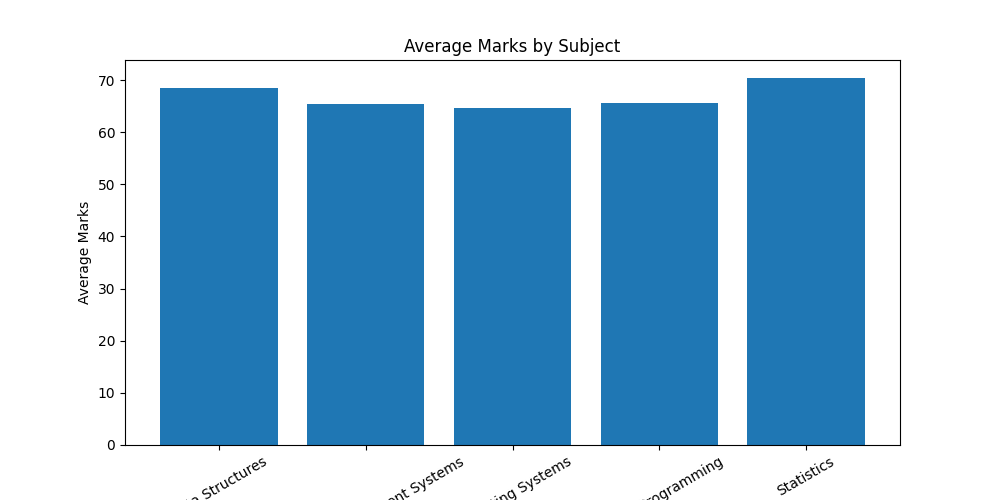
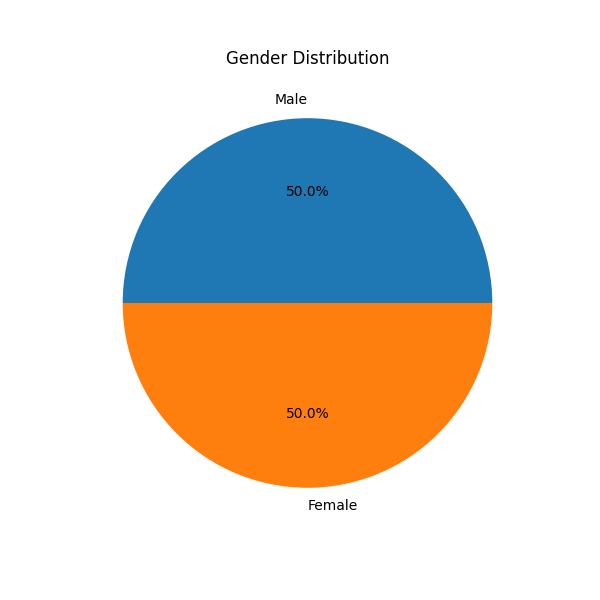
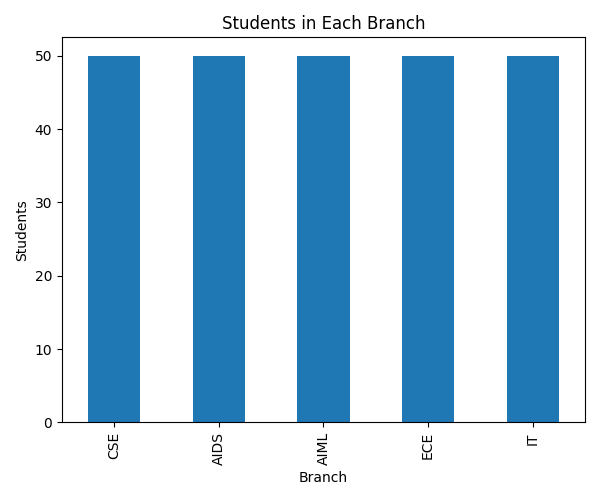
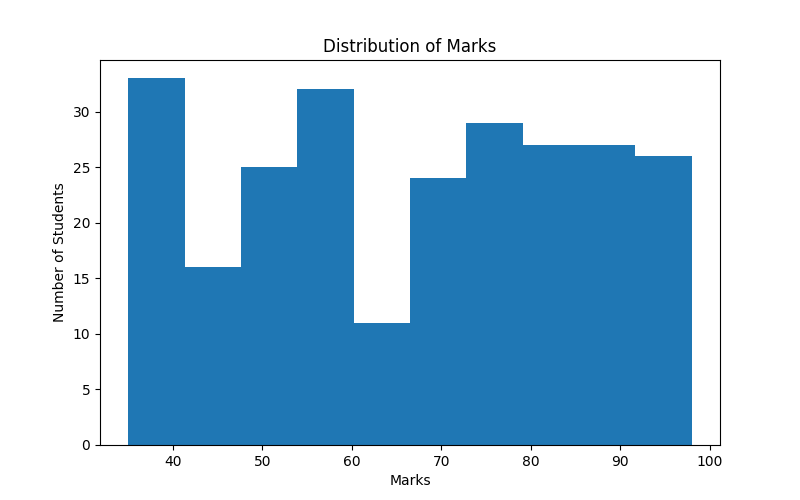
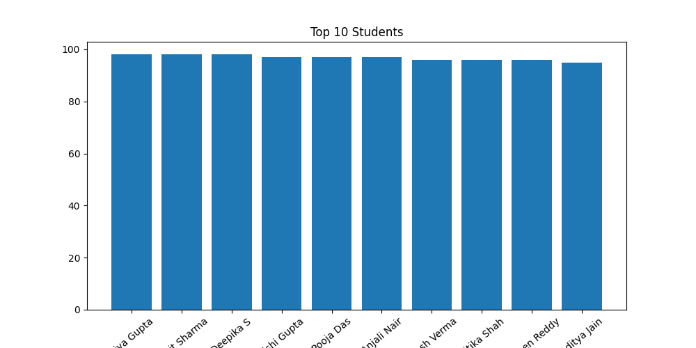

# 📊 Student Performance Analytics System (Version 1)

## 📌 Overview

This project is my **first end-to-end Data Analytics project** built using **MySQL, Python, Pandas, and Power BI**.

The goal of this project was to understand the complete analytics workflow:

- Designing a relational database
- Writing SQL queries
- Connecting Python to MySQL
- Cleaning and merging data using Pandas
- Building an interactive Power BI dashboard

This **Version 1** uses a small dataset (50 students and 250 marks records) and focuses on learning the complete development process before scaling to a larger project.

---

# 🚀 Technologies Used

- Python
- Pandas
- MySQL
- SQL
- Power BI
- Git & GitHub

---

# 📂 Project Structure

```
student-performance-analytics
│
├── data
│   └── final_dataset.csv
│
├── docs
│   ├── dashboard.png
│   ├── sql query.png
│   ├── python working.png
│   ├── branch_average.png
│   ├── subject_average.png
│   ├── gender_distribution.png
│   ├── student_branch_count.png
│   ├── top_students.png
│   └── marks_distribution.png
│
├── python
│   ├── db_connection.py
│   ├── merge.py
│   └── analysis.py
│
├── sql
│   ├── schema.sql
│   └── queries.sql
│
├── student_analytics_dashboard.pbix
├── README.md
└── requirements.txt
```

---

# 🗄 Database Design

The database consists of three relational tables:

- Students
- Subjects
- Marks

Relationships were created using Primary Keys and Foreign Keys.

---

# 🐍 Python Workflow

The Python scripts perform:

- Connect to MySQL
- Read tables into Pandas
- Merge multiple tables
- Perform analysis
- Export cleaned dataset as CSV

---

# 📈 SQL Analysis

Some SQL queries included:

- View all students
- View all subjects
- View all marks
- Average marks by branch
- Average marks by subject
- Highest scoring students
- Student-wise performance report
- INNER JOIN queries
- Aggregate analysis

---

# 📊 Power BI Dashboard

The dashboard includes:

### KPI Cards

- Total Students
- Average Marks
- Highest Marks
- Lowest Marks

### Visualizations

- Average Marks by Branch
- Average Marks by Subject
- Students by Branch
- Students by Gender
- Top Performing Students

### Interactive Filters

- Branch Filter
- Subject Filter

---

# 📸 Dashboard Preview

## Power BI Dashboard


---

## SQL Queries



---

## Python Data Processing



---

# 📊 Additional Visualizations

### Average Marks by Branch



### Average Marks by Subject



### Gender Distribution



### Student Count by Branch



### Marks Distribution



### Top Performing Students



---

# 📚 What I Learned

Through this project I learned how to:

- Design relational databases
- Write SQL queries with JOINs
- Connect Python with MySQL
- Perform data cleaning using Pandas
- Merge multiple datasets
- Build interactive dashboards in Power BI
- Organize an end-to-end analytics project using GitHub

---

# 🔄 Future Improvements (Version 2)

The next version will include:

- 5,000+ students
- 25,000+ records
- Attendance analysis
- GPA calculation
- Semester-wise trends
- Scholarship eligibility
- Performance prediction
- Advanced DAX Measures
- Multi-page Power BI Dashboard
- Better dashboard design
- Realistic large-scale dataset

---

# 👩‍💻 Author

**Sameeksha Reddy**

Currently learning:

- SQL
- Python
- Power BI
- Data Analytics
- C++ & DSA

Building projects one step at a time 🚀

---

⭐ If you found this project helpful, consider giving it a star!
